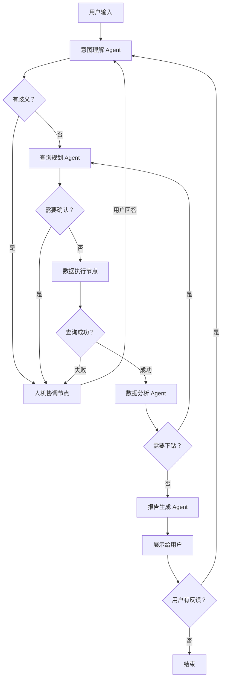

# 广告报表多 Agent 划分设计

## 一、Agent 划分核心原则

| 原则 | 说明 |
|------|------|
| **单一职责** | 每个 Agent 只做一件事，做到极致 |
| **按流程阶段划分** | 对应"理解 → 规划 → 执行 → 分析 → 报告"的自然分析流程 |
| **明确契约** | 每个 Agent 有清晰的 Input/Output Schema，不依赖内部实现 |
| **人机交互单独抽离** | 人的参与是特殊节点，会暂停执行等待输入 |
| **可独立测试** | 每个 Agent 可以单独写单元测试，不需要依赖其他 Agent |
| **可独立优化** | 可以单独提升某个 Agent 的能力，不影响整体 |

---

## 二、最终 Agent 划分方案（6 节点）

```
用户输入
    ↓
┌─────────────────────────────────────────┐  ← LLM Agent
│      🧠 意图理解 Agent (NLU)           │
│  把自然语言 → 结构化查询意图            │
└─────────────────────────────────────────┘
    ↓ 有歧义？
┌─────────────────────────────────────────┐  ← 特殊节点（人机交互）
│       ❓ 人机协调节点                   │
│  生成澄清选项 → 等待用户回答 → 继续     │
└─────────────────────────────────────────┘
    ↓ 意图清晰
┌─────────────────────────────────────────┐  ← LLM Agent
│      📋 查询规划 Agent (Planner)       │
│  意图 → 合法的 QueryRequest 对象        │
└─────────────────────────────────────────┘
    ↓
┌─────────────────────────────────────────┐  ← 函数节点（不需要 LLM）
│       ⚡ 数据执行节点                   │
│  调用 execute_query 拿数据              │
└─────────────────────────────────────────┘
    ↓
┌─────────────────────────────────────────┐  ← LLM Agent
│       📊 数据分析 Agent (Analyst)      │
│  检测异常、算贡献度、做对比分析          │
└─────────────────────────────────────────┘
    ↓
┌─────────────────────────────────────────┐  ← LLM Agent
│       📝 报告生成 Agent (Reporter)     │
│  整合数据 + 洞察 → 友好的报告输出       │
└─────────────────────────────────────────┘
    ↓
展示给用户 → 用户反馈 → 回到意图理解（增量修改）
```

---

## 三、每个 Agent 的详细设计

### Agent 1：🧠 意图理解 Agent (NLU Agent)

**定位：** 用户输入的第一道门，自然语言理解的核心

**核心职责：**
| 输入 | 处理逻辑 | 输出 |
|------|---------|------|
| 用户当前输入 + 历史会话上下文 + 当前 State | 1. 业务术语映射<br>2. 时间范围解析<br>3. 指标/维度/过滤条件提取<br>4. 识别用户是"新查询"还是"修改上一个查询"<br>5. 检测歧义 | `QueryIntent` 对象（结构化意图） + 歧义标记 |

**专属 Tool 列表：**
- `parse_time_range` - 解析自然语言时间
- `map_business_terms` - 业务术语映射
- `get_advertiser_list` - 获取广告主列表（当广告主不明确时预取）

**Prompt 核心要点：**
```
你是广告报表意图理解专家。

你的任务是把用户的自然语言输入，解析成结构化的查询意图。

已知业务术语映射：
- 曝光/展示 → impressions
- 点击 → clicks
- 花费/消耗 → cost
- 点击率/CTR → ctr
- 转化率/CVR → cvr
- 投产比/ROI → roi
- 安卓/Android → audience_os=2
- 苹果/iOS → audience_os=1
- ...

已知维度列表：data_date, data_week, data_month, advertiser_id, campaign_id, adgroup_id, creative_id, audience_gender, audience_age, audience_os, audience_interest

请输出 QueryIntent JSON 对象，包含：
- time_range: {start_date, end_date, unit}
- metrics: [指标列表]
- group_by: [维度列表]
- filters: [过滤条件列表]
- is_incremental: bool（是否是在上一个查询基础上修改）
- ambiguity: {has_ambiguity, reason, missing_info}（是否有歧义）
```

**典型应用场景：**
- 用户："看上周移动端的 CTR" → 解析出时间=上周，指标=[ctr], filters=[audience_os=2]
- 用户："分渠道看" → 识别出是增量修改，在现有查询基础上加 group_by=[campaign_id]
- 用户："看效果" → 检测到歧义（效果指什么指标？），标记需要澄清

**推荐模型：** Claude 3 Haiku / GPT-3.5-turbo  
**实现难度：** 🌟🌟🌟

---

### Agent 2：📋 查询规划 Agent (Query Planner)

**定位：** 把结构化意图转成**可执行、合法、最优**的查询参数

**核心职责：**
| 输入 | 处理逻辑 | 输出 |
|------|---------|------|
| QueryIntent + State | 1. 补全缺失的默认值<br>2. 处理特殊业务规则（受众维度的索引选择）<br>3. 自动选择图表类型<br>4. 校验参数合法性<br>5. 生成优化建议 | `QueryRequest` 对象 + 校验结果 + 优化警告 |

**专属 Tool 列表：**
- `validate_query_request` - 参数合法性校验
- `auto_select_chart_type` - 自动选择图表类型
- `get_dimension_values` - 获取维度可选值（用于补全过滤条件）

**Prompt 核心要点：**
```
你是广告报表查询规划专家。

你的任务是把查询意图转换成合法的 QueryRequest 对象。

重要业务规则：
1. 如果分组维度包含 audience_* 字段：
   - 必须使用 ad_stat_audience 索引
   - 必须添加对应的 audience_type 过滤：
     audience_gender → audience_type=1
     audience_age → audience_type=2
     audience_os → audience_type=3
     audience_interest → audience_type=4

2. 图表选择规则：
   - 有时间维度 → line 折线图
   - 分类维度 < 10 → bar 柱状图
   - 分类维度 < 5 + 看占比 → pie 饼图
   - 其他 → table 表格

3. 默认值：
   - mode 默认用 interactive
   - 没有指定排序时，按第一个指标降序
```

**典型应用场景：**
- 用户要按性别分组 → 自动切换到受众索引，添加 audience_type=1 过滤
- 用户选了 5 个维度 → 发出警告"维度太多，图表可能难以阅读"
- 用户查询范围 1 年按天 → 建议"数据量较大，要不要改成按月汇总？"

**推荐模型：** Claude 3 Haiku / GPT-3.5-turbo  
**实现难度：** 🌟🌟🌟

---

### 节点 3：❓ 人机协调节点（特殊节点，非 LLM Agent）

**定位：** 管理人机交互的"暂停-等待-恢复"流程

**核心职责：**
| 输入 | 处理逻辑 | 输出 |
|------|---------|------|
| 歧义类型 + 可能选项 + 上下文 | 1. 调用 Tool 生成标准化的澄清选项<br>2. 展示给用户<br>3. 暂停 Graph 执行<br>4. 收到用户回答后恢复执行 | 用户的澄清答案 |

**专属 Tool：**
- `generate_clarification_options` - 生成澄清选项

**典型澄清场景：**
1. **指标歧义：** "你说的'效果'具体想看哪些指标？" → [曝光+点击, CTR+CVR, 花费+ROI, 全部]
2. **维度歧义：** "你想按什么维度分组查看？" → [日期, 渠道, 广告组, 创意, 受众]
3. **广告主不明确：** "有 3 个名字带'京东'的广告主，请选择具体是哪个"
4. **范围过大：** "这个查询预计返回 3650 条数据，耗时约 8 秒，是否确认？" → [确认, 改成按月汇总, 缩小时间范围]

**推荐模型：** 不需要 LLM，纯逻辑控制  
**实现难度：** 🌟🌟

---

### 节点 4：⚡ 数据执行节点（函数节点，不需要 LLM）

**定位：** 可靠地执行查询，获取数据

**核心职责：**
| 输入 | 处理逻辑 | 输出 |
|------|---------|------|
| QueryRequest | 1. 调用 execute_query 函数<br>2. 错误处理（超时、空结果、异常）<br>3. 重试机制 | 查询结果 + 执行状态（成功/失败/空结果） |

**专属 Tool：**
- `execute_ad_report_query` - 执行报表查询（核心 Tool）

**典型场景：**
- 正常执行 → 返回数据
- 查询超时 → 返回友好的错误信息，建议缩小范围
- 空结果 → 建议"这个时间范围没有数据，要不要扩大到最近 30 天？"

**实现难度：** 🌟（100% 复用现有代码）

---

### Agent 5：📊 数据分析 Agent (Data Analyst)

**定位：** 深度分析数据，产出人类分析师级别的洞察

**核心职责：**
| 输入 | 处理逻辑 | 输出 |
|------|---------|------|
| 查询结果 + QueryRequest + 上下文 | 1. 检测异常点（大幅涨跌）<br>2. 计算环比同比<br>3. 计算维度贡献度（归因分析）<br>4. 排名分析（Top/Bottom）<br>5. 趋势分析 | 结构化的 AnalysisResult（异常点列表 + 洞察列表 + 建议） |

**专属 Tool 列表：**
- `detect_anomalies` - 异常检测
- `calculate_contribution` - 贡献度计算
- `compare_datasets` - 数据集对比
- `execute_ad_report_query` - 自动下钻查询

**Prompt 核心要点：**
```
你是资深广告数据分析专家。

你的任务是从数据中发现有价值的洞察，而不是简单复述数字。

分析方法：
1. 先看整体趋势：是上涨还是下跌？幅度多大？
2. 找异常点：哪些维度的指标偏离了正常范围？
3. 算贡献度：变化主要来自哪些维度的贡献？
4. 做对比：和历史均值比，和标杆比？
5. 给建议：基于发现的问题，应该怎么做？
```

**典型应用场景：**
- 拿到渠道 CTR 数据 → 发现 A 渠道 CTR 环比下降 32% → 自动下钻查广告组 → 发现创意 12345 导致
- 花费上涨 50% → 自动计算各渠道贡献度 → 60% 来自新增渠道，30% 来自 CPC 上涨

**推荐模型：** Claude 3 Sonnet / GPT-4  
**实现难度：** 🌟🌟🌟🌟

---

### Agent 6：📝 报告生成 Agent (Reporter)

**定位：** 把"数据 + 洞察"整合成用户友好的最终输出

**核心职责：**
| 输入 | 处理逻辑 | 输出 |
|------|---------|------|
| QueryRequest + 查询结果 + AnalysisResult | 1. 生成友好的报告文案<br>2. 高亮关键指标和异常点<br>3. 生成报表 URL<br>4. 推荐后续可能的分析方向 | 完整的报告内容（文字 + 链接 + 推荐问题） |

**专属 Tool 列表：**
- `generate_report_url` - 生成报表 URL
- `suggest_next_queries` - 推荐后续分析问题
- `export_to_excel` - 导出 Excel
- `send_notification` - 发送通知

**Prompt 核心要点：**
```
你是广告报告撰写专家。

你的任务是生成清晰、专业、有洞察力的报告。

写作要求：
1. 先给结论，再给数据，不要堆砌数字
2. 异常点用 🔴 高亮，好的表现用 🟢 高亮
3. 数字要格式化：百分比保留 2 位小数，大数字用千分位
4. 建议要具体可执行，不要空泛
```

**推荐模型：** Claude 3 Sonnet / GPT-4  
**实现难度：** 🌟🌟🌟

---

## 四、Agent 职责边界对照表

| 任务 | 归哪个 Agent | 原因 |
|------|------------|------|
| 解析"上周"是什么日期 | 意图理解 Agent | 属于自然语言理解 |
| "投产比"映射到 ROI | 意图理解 Agent | 属于术语理解 |
| 按性别分组要加 audience_type=1 过滤 | 查询规划 Agent | 属于查询构造的业务规则 |
| 选择用折线图还是柱状图 | 查询规划 Agent | 属于查询输出规划 |
| 向用户澄清"看什么指标" | 人机协调节点 | 属于人机交互 |
| 执行查询拿数据 | 数据执行节点 | 纯执行逻辑 |
| 检测 CTR 下降 30% 是不是异常 | 数据分析 Agent | 属于数据分析 |
| 自动下钻查创意维度 | 数据分析 Agent | 属于分析过程的自动扩展 |
| 计算各渠道对花费上涨的贡献度 | 数据分析 Agent | 属于归因分析 |
| 生成报告 URL | 报告生成 Agent | 属于输出阶段 |
| 推荐"要不要按受众拆分" | 报告生成 Agent | 属于后续建议 |
| 用户说"改成柱状图" | 意图理解 → 查询规划 | 增量修改流程 |

**关键规则：** 上游 Agent 不要做下游的事，下游 Agent 信任上游的输出。

---

## 五、完整协作流程图（Graph 结构）



**关键设计：**
1. **两个人机交互入口**：澄清歧义 / 确认高风险操作
2. **自动下钻闭环**：数据分析 Agent 发现异常后，可以回到查询规划
3. **用户反馈闭环**：用户的任何反馈都回到意图理解 Agent，支持增量修改
4. **错误闭环**：查询失败后回到人机协调，让用户调整条件

---

## 六、这不是线性 DAG，是带循环的图

### 3 个核心循环（线性 DAG 做不到）

#### 循环 1：歧义澄清循环
```
意图理解 → 人机协调 → 意图理解
```
**触发条件：** 意图理解 Agent 发现用户输入有歧义  
**终止条件：** 意图清晰，没有歧义

#### 循环 2：自动下钻循环
```
数据分析 → 查询规划 → 执行 → 数据分析
```
**触发条件：** 数据分析 Agent 发现异常，需要查更细的维度  
**终止条件：** 已到最细维度 / 下钻次数达到上限 / 异常已解释清楚

#### 循环 3：用户反馈大循环
```
报告生成 → 用户反馈 → 意图理解 → 重新走流程
```
**触发条件：** 用户对结果不满意，提出修改要求  
**终止条件：** 用户说"没问题了"或者主动结束会话

---

## 七、State 字段与读写权限设计

| State 字段 | 写入者 | 读取者 | 说明 |
|-----------|--------|--------|------|
| `user_input` | 入口 | 意图理解 | 用户原始输入 |
| `history` | 报告生成 | 意图理解 | 历史会话列表 |
| `query_intent` | 意图理解 | 查询规划 | 结构化查询意图 |
| `ambiguity` | 意图理解 / 查询规划 | 人机协调 | 歧义信息 |
| `user_feedback` | 人机协调 | 意图理解 / 查询规划 | 用户的澄清答案 |
| `query_request` | 查询规划 | 数据执行 / 分析 | 最终查询参数 |
| `query_result` | 数据执行 | 数据分析 / 报告 | 查询结果 |
| `analysis_result` | 数据分析 | 报告生成 | 分析洞察 |
| `drill_down_count` | 数据分析 | 查询规划 | 下钻次数（防止无限下钻） |
| `final_report` | 报告生成 | 输出 | 最终报告 |

---

## 八、落地优先级与阶段规划

### 第一阶段（1-2 周）：跑通主流程
**实现 3 个核心节点：**
1. ✅ 数据执行节点（最简单，100% 复用现有代码）
2. ✅ 查询规划 Agent（核心是 QueryRequest 生成）
3. ✅ 报告生成 Agent（生成报告和 URL）

**目标：** 用户说"看昨天的曝光点击" → 系统能查数据 → 生成报表 URL

---

### 第二阶段（2-3 周）：完善交互和理解
**实现 2 个节点：**
4. 🔄 意图理解 Agent（核心难点：上下文理解、增量修改）
5. 🔄 人机协调节点（核心难点：前端交互）

**目标：** 支持上下文对话，支持澄清歧义
```
用户：看上周的 CTR
用户：分渠道看  ← 不用重复说上周
用户：把最差的那个再按创意拆
```

---

### 第三阶段（3-4 周）：核心分析能力
**实现最后 1 个 Agent：**
6. 🔄 数据分析 Agent（核心难点：异常检测、自动下钻）

**目标：** 查询完数据后自动告诉你"发现 A 渠道 CTR 下降 32%，主要原因是..."

---

### 第四阶段（长期）：高级功能
- 归因分析
- 对比分析
- 报表模板
- 订阅推送

---

## 九、模型选择建议

| Agent | 推荐模型 | 原因 |
|-------|---------|------|
| 意图理解 | Claude 3 Haiku / GPT-3.5-turbo | 任务简单，需要速度快 |
| 查询规划 | Claude 3 Haiku / GPT-3.5-turbo | 结构化生成，不需要太强推理 |
| 数据分析 | Claude 3 Sonnet / GPT-4 | 需要较强的分析和推理能力 |
| 报告生成 | Claude 3 Sonnet / GPT-4 | 需要较强的文案和总结能力 |

**成本优化：** 简单任务用便宜模型，只有复杂的分析和写作任务用好模型，整体成本其实比一个全能 Agent 用 GPT-4 还低。

---

## 十、常见问题解答

### 1. 为什么不做一个全能 Agent？
| 维度 | 一个全能 Agent | 多个细分 Agent |
|------|-------------|--------------|
| Prompt 长度 | 超长（要懂所有东西） | 每个很短很精准 |
| 可观测性 | 黑盒，不知道哪错了 | 可以看每个节点的输出 |
| 调试难度 | 极高 | 每个节点可单独调试 |
| 模型选择 | 只能用最贵的模型 | 简单任务用便宜模型 |
| 迭代效率 | 改一处可能影响全局 | 可以单独优化某个 Agent |

**结论：** 一个全能 Agent 只有在简单场景下划算，对于复杂的分析场景，多 Agent 完胜。

---

### 2. 为什么需要 6 个这么多？3 个不行吗？

可以合并，但不推荐。比如：
- 把意图理解 + 查询规划合并 → Prompt 会很长，职责不清
- 把数据分析 + 报告生成合并 → 分析逻辑和写作逻辑混在一起，难以调试

**最佳实践：** 当你发现某个 Agent 的 Prompt 超过 300 字，或者需要同时调用 3 种以上完全不同的 Tool，就应该考虑拆分。

---

### 3. 人机协调节点为什么不做成 Agent？

因为人机协调节点的核心是**控制流**，不是**推理**。它不需要 LLM 来决定"问用户什么问题"，只需要按照预设的逻辑调用 Tool 生成选项，然后等待用户输入。

做成纯函数节点的好处：
- 性能更好，没有 LLM 调用延迟
- 逻辑更确定，不会出现 LLM 问出奇怪问题的情况
- 更容易和前端 UI 对接

---

## 十一、架构优势总结

1. **职责极度清晰**：每个节点只做一件事，没有重叠
2. **人机友好**：专门的节点处理人的参与，支持暂停-恢复
3. **性能最优**：简单任务用便宜模型，纯逻辑不用模型
4. **易调试易迭代**：每个节点可以单独测试、单独优化
5. **闭环完整**：自动下钻闭环 + 用户反馈闭环 + 错误处理闭环
